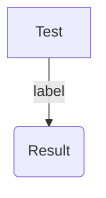

# Design Decisions
*Concise summary of how the system should look like. Provide links for longer motivational material and reasons that led to these decisions. Don't provide any implementation details yet.*
Install the [Mermaid browser extension](https://github.com/BackMarket/github-mermaid-extension#install) to see the diagrams. [Mermaid live editor](https://mermaid-js.github.io/mermaid-live-editor).

# High Level Goals
- A system to collaboratively collect information used for decision making. Not decision making itself.

# Terminology
- **Claim**: 

# Ideal Product

## Data Model / Mental Model

## Curation System

# Minimum Viable Product

# Open Questions
*If you have a good answer to one of these questions, please get in touch.*

# Related Work
*Only add work that you have read yourself. Also provide a short summary of what can be learnt from the source.*
